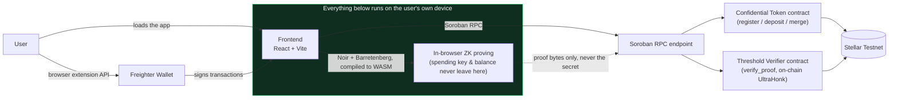
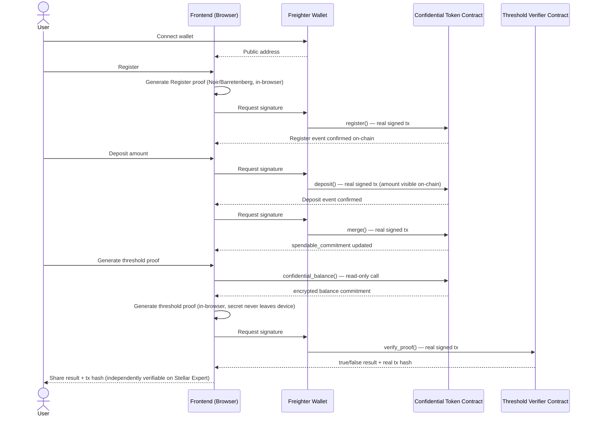

# ProofPay

**Prove your income clears a bar. Not what it actually is.**

ProofPay lets someone prove their on-chain balance is at or above a threshold they
choose — to a landlord, a lender, or a platform — using a real zero-knowledge proof
generated entirely in their browser and verified on Stellar testnet. No backend ever
sits in the trust path: your spending key and your exact balance never leave your
device.

[](https://github.com/Hermit210/proof-pay-/actions/workflows/ci.yml)
[](LICENSE)

---

## Table of contents

1. [The problem](#the-problem)
2. [What ProofPay does](#what-proofpay-does)
3. [Live links](#live-links)
4. [Architecture](#architecture)
5. [User flow](#user-flow)
6. [Why Stellar — and the honest disclosure](#why-stellar--and-the-honest-disclosure)
7. [Tech stack](#tech-stack)
8. [Setup](#setup)
9. [Testing](#testing)
10. [Deployment](#deployment)
11. [CI/CD](#cicd)
12. [Analytics & error monitoring](#analytics--error-monitoring)
13. [Screenshots](#screenshots)
14. [Requirements checklist](#requirements-checklist)
15. [What's real vs. the honest caveat](#whats-real-vs-the-honest-caveat)
16. [License & credits](#license--credits)

---

## The problem

Proving you can afford something — rent, a loan, a platform's income bar — normally
means handing over a full bank statement or a complete on-chain transaction history.
That answers a much bigger question than was actually asked. On most chains this is
worse than off-chain: every deposit, balance, and transfer an address has ever made is
already public to anyone who looks it up. Gig and freelance income increasingly arrives
on-chain, which means the exposure is already happening today, not a hypothetical.

## What ProofPay does

You deposit into a confidential balance, then generate a proof — entirely in your
browser — that the balance is at or above a number you choose. A smart contract verifies
that proof on-chain and returns a plain `true`/`false`. Nobody, not even ProofPay, ever
sees the actual balance. You get a real transaction hash anyone can independently check
on a block explorer, without trusting ProofPay's word for it.

---

## Live links

| Resource | Link |
|:---|:---|
| Live app | ⬜ pending deployment — see [Deployment](#deployment) |
| GitHub repo | [github.com/Hermit210/proof-pay-](https://github.com/Hermit210/proof-pay-) |
| Confidential Token contract | [`CDSZUHSW...R5Z5Y`](https://stellar.expert/explorer/testnet/contract/CDSZUHSWCLZVPFHTG6556MAEKPUUCH4UKMGOIH7O2KT4UKHW4AJR5Z5Y) |
| Threshold verifier contract | [`CCIZWGDU...M34`](https://stellar.expert/explorer/testnet/contract/CCIZWGDUTKWELJWHGRM2DSWBOW247RS75POK4FTHIRU6OGYHDCR4JM34) |
| Example register tx | [`1aea5f32...92a528`](https://stellar.expert/explorer/testnet/tx/1aea5f32156d38bf6dc7d27c1b3a96d95a4360c8d1eb5136501c759dc092a528) |
| Example deposit tx | [`bdd9e391...2d2beb`](https://stellar.expert/explorer/testnet/tx/bdd9e3910f810a546e23471bbd96b56c61be19a81c753e0f03ef2d26eb2d2beb) |
| Example proof-verification tx | [`0e02c961...2848c8`](https://stellar.expert/explorer/testnet/tx/0e02c9617c97e6f8b3450a4a085977de2d4d5a410b61abccd24e590f0d2848c8) |
| CI workflow | [Actions tab](https://github.com/Hermit210/proof-pay-/actions/workflows/ci.yml) |
| Demo video | ⬜ placeholder — added after recording |

---

## Architecture

No backend server exists anywhere in this product's trust path — that's not a
simplification, it's load-bearing, and the diagram says so explicitly.



**No backend server anywhere in this path.** The frontend talks directly to Soroban RPC
and the deployed contracts; there is no ProofPay-operated server that could see a
balance, hold a key, or lie about a result.

## User flow

The real golden path — every arrow into a contract is either a **real signed
transaction** (mutates on-chain state) or an explicitly-labeled **read-only call**.



---

## Why Stellar — and the honest disclosure

This runs on Stellar's **Confidential Tokens**, which shipped as a
[developer preview](https://stellar.org/blog/developers/developer-preview-confidential-tokens-on-stellar)
as part of Protocol 25 ("X-Ray"). Balances are Pedersen commitments on the Grumpkin
curve rather than plaintext numbers, with real Noir circuits and checked-in verification
keys behind the state-changing operations.

**Disclosed plainly, not buried:**

- Stellar's own announcement states Confidential Tokens are **not yet approved for
  mainnet** and audits are underway.
- The on-chain UltraHonk verifier this app depends on (`ultrahonk_soroban_verifier`, by
  Nethermind) is likewise **unaudited**, and currently implements only the **non-ZK proof
  flavor** — meaning today's privacy guarantee rests on the Pedersen commitment scheme's
  own hiding property, not on proof-transcript zero-knowledge. That stronger guarantee
  ships once an audited ZK-flavor verifier is released.
- **Everything in this repo runs on Stellar testnet only. Do not use with real funds.**
- `stellar-tokens`'s confidential module isn't published to crates.io yet — this project
  depends on a specific pinned commit of OpenZeppelin's `main` branch via a git
  dependency (see [Cargo.toml](contract/Cargo.toml)).

### Why this exists (the Confidential Tokens pivot)

The original plan assumed a chunk of the hard cryptography — specifically Selective
Disclosure's `disclose_balance_ge` (exactly "prove balance ≥ threshold") — was already
built into OpenZeppelin's Confidential Tokens module. Reading the actual source
(`packages/tokens/src/confidential/`) showed that premise was only half true:

- **Real and working:** hidden balances/transfers via Pedersen commitments, 6 compiled
  Noir circuits with checked-in verification keys, satellite verifier/auditor/compliance
  contracts.
- **Spec-only, not code:** the Selective Disclosure layer — including the exact
  `disclose_balance_ge` primitive this product needed. Verified by grepping the whole
  repo for `disclose_*`: zero hits outside documentation, no compiled VK for any disclose
  circuit.
- **`ConfidentialVerifier::verify_proof` had no body at all** — every proof-carrying
  entry point was unverifiable on-chain until a real UltraHonk backend was wired in.

The actual work: a new, scoped Noir circuit for the threshold check (viewing-key
ownership + a Pedersen-opening + a threshold comparison — no ECDH, no encryption chains),
plus integrating Nethermind's `rs-soroban-ultrahonk` as the on-chain verifier backend,
patched to the `soroban-sdk` version OpenZeppelin's module actually needs. Full research
trail in [`docs/research/`](docs/research/).

---

## Tech stack

| Layer | Technology |
|:---|:---|
| Contract | Soroban (Rust), Confidential Token (OpenZeppelin, pinned git commit), UltraHonk verifier ([`rs-soroban-ultrahonk`](https://github.com/NethermindEth/rs-soroban-ultrahonk), Nethermind) |
| Proving | Noir (`@noir-lang/noir_js` ^1.0.0-beta.9), Barretenberg (`@aztec/bb.js` ^0.87.0) — compiled to WASM, runs entirely client-side |
| Frontend | React 19, TypeScript, Vite 8, `react-router-dom` 7 |
| Motion | `motion` ^13 (scroll reveals, staggered lists, shared transition presets) |
| Wallet | Freighter (`@stellar/freighter-api` ^6), `@stellar/stellar-sdk` ^16 |
| Analytics | PostHog (`posthog-js`) — wired, currently no key configured |
| Monitoring | Sentry (`@sentry/react`) — wired, currently no DSN configured |
| Testing | Vitest 4 + React Testing Library (frontend, 36 tests); `cargo test` (contract, 15 tests) |
| Linting | oxlint |
| CI/CD | GitHub Actions |
| Deployment | Vercel (config ready, not yet deployed) |

`@formkit/auto-animate` is present in `package.json` but genuinely unused in the
codebase right now — noted here rather than silently left in the dependency tree.

---

## Setup

### Prerequisites

- Node.js 22+, Rust stable (for the contracts), the [Freighter](https://freighter.app)
  wallet extension set to **Testnet**.

### Frontend

```bash
cd frontend
npm install
cp .env.example .env.local   # fill in the contract IDs from the table below
npm run dev
```

Required env vars (see [`.env.example`](frontend/.env.example)):

```bash
VITE_SOROBAN_RPC_URL=https://soroban-testnet.stellar.org
VITE_NETWORK_PASSPHRASE="Test SDF Network ; September 2015"
VITE_TOKEN_CONTRACT_ID=CDSZUHSWCLZVPFHTG6556MAEKPUUCH4UKMGOIH7O2KT4UKHW4AJR5Z5Y
VITE_VERIFIER_CONTRACT_ID=CCWMZNZQ2IQDLI7CSJWEARBZW47WBN4NL5PUXV52SJG7RCZ5CSTXS26Z
VITE_THRESHOLD_VERIFIER_CONTRACT_ID=CCIZWGDUTKWELJWHGRM2DSWBOW247RS75POK4FTHIRU6OGYHDCR4JM34
VITE_AUDITOR_CONTRACT_ID=CCQNLPV2B2NV6SJCWZZ5EQF6ZV6IU7O5SMAY5ILUGJV7SB7XLLYPYIXO
# Optional -- the app runs fully without these, just without tracking:
VITE_POSTHOG_KEY=
VITE_POSTHOG_HOST=https://us.i.posthog.com
VITE_SENTRY_DSN=
```

Other real scripts (`frontend/package.json`): `npm run build` (typecheck + Vite build),
`npm run lint` (oxlint), `npm run typecheck` (`tsc -b`), `npm run preview`.

### Contracts

```bash
cd contract
cargo test --workspace    # unit + integration tests, real UltraHonk proof verification
cargo build --workspace   # native compile check
```

Full deploy/reproduce steps (Soroban CLI, `wasm32v1-none` target, real `stellar contract
deploy`/`invoke` commands) are in [`docs/deployment/testnet.md`](docs/deployment/testnet.md).

---

## Testing

51 real tests total, both suites currently green.

```bash
cd frontend && npm run test        # Vitest + React Testing Library, one-shot
cd contract  && cargo test --workspace
```

Real terminal output from the last run (2026-08-28):

```
 ✓ src/services/parseAmount.test.ts       (7 tests)
 ✓ src/services/localWalletState.test.ts  (6 tests)
 ✓ src/services/history.test.ts           (5 tests)
 ✓ src/features/wallet-connect/useWallet.test.ts        (5 tests)
 ✓ src/features/deposit/useDeposit.test.ts               (5 tests)
 ✓ src/features/prove-threshold/useProveThreshold.test.ts (8 tests)

 Test Files  6 passed (6)
      Tests  36 passed (36)
```

```
running 6 tests   (threshold_verifier_test.rs -- real UltraHonk proof verification)
test verifies_a_real_proof_that_the_balance_clears_the_threshold ... ok
test result: ok. 6 passed; 0 failed

running 3 tests   (proofpay_token)
test result: ok. 3 passed; 0 failed

running 6 tests   (proofpay_verifier)
test result: ok. 6 passed; 0 failed
```

Frontend coverage: confidential-balance accrual logic, the real on-chain history log,
form validation (including a caught bug — decimal/non-numeric input used to crash
`BigInt()` parsing outside any try/catch), wallet-connect error states (not-installed /
wrong-network / user-declined / success), and the on-chain confirmation gate (register/
deposit/prove all independently re-verify a submitted transaction before reporting
success — never trust `signAndSend()` resolving alone).

---

## Deployment

Frontend is a static Vite build (`frontend/vercel.json` configures the build command,
output directory, and an SPA rewrite for client-side routing).

```bash
cd frontend
vercel link      # first time: set Root Directory to `frontend`
vercel env add   # add the VITE_* vars above for Production
vercel --prod
```

**Live URL:** ⬜ not yet deployed — blocked on completing `vercel login` in this
environment. To be added the moment it's live.

---

## CI/CD

[](https://github.com/Hermit210/proof-pay-/actions/workflows/ci.yml)

Every push/PR to `main` runs two jobs (see
[`.github/workflows/ci.yml`](.github/workflows/ci.yml)), both currently green:

- **Frontend:** lint (oxlint) → typecheck (`tsc`) → test (Vitest) → build (Vite)
- **Contract:** `cargo test --workspace` (unit + the threshold-verifier integration
  suite, real proof verification) → `cargo build --workspace`

---

## Analytics & error monitoring

[PostHog](https://posthog.com) (product events: wallet connect, register, deposit,
proof generated/verified) and [Sentry](https://sentry.io) (error capture) are wired in
via `frontend/src/services/analytics.ts`. **Status right now: integrated in code, not
yet live** — `VITE_POSTHOG_KEY` and `VITE_SENTRY_DSN` are unset in this environment, so
nothing is actively being collected yet. The app runs identically either way; setting
both is a config-only step (no code change) once a real project exists to send data to.

---

## Screenshots

_(To be added — real images only, no placeholders left in once provided.)_

| Product UI (desktop) | Mobile (~390px) | Analytics dashboard | Wallet options |
|:---:|:---:|:---:|:---:|
| ⬜ | ⬜ | ⬜ | ⬜ |

---

## Requirements checklist

Re-verified against actual current state on 2026-08-28 — not carried over from an
earlier check. ✅ = genuinely true right now, 🟡 = real but partial, ⬜ = not done.

| Requirement | Status | Notes |
|:---|:---:|:---|
| Fully functional production-ready MVP | 🟡 | Functional end-to-end on real testnet; not yet live in production (see Deployment) |
| Stable frontend and smart contract architecture | ✅ | 51 real tests passing, CI green on both |
| Mobile responsive UI | 🟡 | Real responsive CSS across nav/hero/grids/forms; not visually verified on a physical device this session |
| Proper loading states and error handling | ✅ | Per-stage states (e.g. "Confirming on-chain..."), real error messages surfaced, no fake success on any path |
| Minimum 10 real users onboarded | ⬜ | Manual work, not started |
| Proof of wallet interactions | ✅ | Real tx hashes + Stellar Expert links, both in this README and the app's History page |
| Basic user feedback collection | ⬜ | Manual work, not started |
| Production deployment | ⬜ | Vercel config ready; blocked on completing `vercel login` |
| Monitoring and analytics integration | 🟡 | PostHog + Sentry wired in code; no live key configured yet |
| Optimized user experience | 🟡 | Structured color/spacing/typography system and motion pass done this session; not user-tested |
| Proper project structure and documentation | ✅ | This README, `docs/research/`, `docs/deployment/`, CI config |
| Smart contracts deployed on Stellar testnet | ✅ | Real addresses, verified against `docs/deployment/testnet.md` |
| Minimum 15+ meaningful commits | ✅ | **83** commits (`git log --oneline \| wc -l`, checked 2026-08-28) |
| Public GitHub repository | ✅ | [github.com/Hermit210/proof-pay-](https://github.com/Hermit210/proof-pay-) |
| Live demo video | ⬜ | Manual work, not started |

---

## What's real vs. the honest caveat

**Genuinely real and verified:** the deployed contracts and every tx hash above are
real, independently checkable on Stellar Expert right now. The threshold proof is
generated by real Noir circuits compiled to WASM, verified byte-for-byte identical to
the native toolchain's output before being trusted, and checked on-chain by a real
UltraHonk verifier — not simulated, not mocked. Register, deposit, merge, and
verify-threshold all independently re-confirm on-chain state before reporting success,
closing a real false-success bug found and fixed earlier in this project
(`docs/research/step3c-register-false-success.md`).

**The honest limitation:** Confidential Tokens are an unaudited developer preview, the
UltraHonk verifier is unaudited and running its non-ZK proof flavor (privacy currently
rests on Pedersen-commitment hiding, not proof-transcript zero-knowledge), and this all
runs on **testnet only**. Production deployment, live analytics, and the human-facing
requirements (user onboarding, feedback, demo video) are not done yet.

---

## License & credits

MIT — see [LICENSE](LICENSE).

Built on real open-source work from:

- [OpenZeppelin](https://github.com/OpenZeppelin/stellar-contracts) — Confidential
  Tokens module (Soroban), pinned to a pre-release git commit
- [Nethermind](https://github.com/NethermindEth/rs-soroban-ultrahonk) —
  `rs-soroban-ultrahonk`, the on-chain UltraHonk verifier backend
- [Aztec](https://github.com/AztecProtocol/aztec-packages) — Noir and Barretenberg
  (`noir_js`, `bb.js`), compiled to WASM for in-browser proving
- [Stellar Development Foundation](https://stellar.org) — Soroban, Confidential Tokens
  (Protocol 25 "X-Ray"), Freighter wallet
